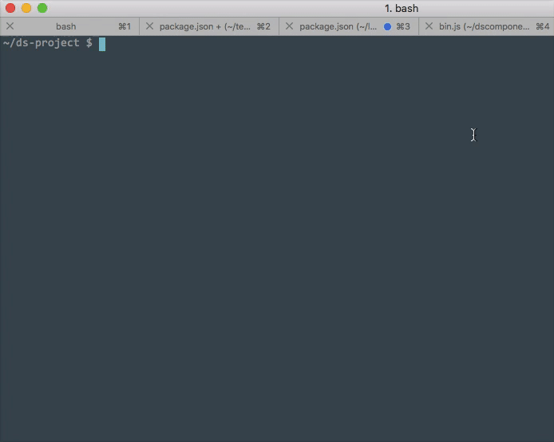

# DSComponent

A command line utility to assist in the creation of DS Boilerplate components. Create a new component in your projects components directory with Twig, Sass, and optional JS ready to go.

## Usage

```bash
$ dscomponent <component-name> [options]
```



## Install

```bash
# clone this repo
$ git clone git@github.com:digitalsurgeons/dscomponent.git

# install dependencies
$ cd dscomponent
$ npm i

# install module globally
$ npm i -g ./
   or
$ npm link

# run command from the root of any project
$ dscomponent component-name  
```

### API

```bash
A command line utility to assist in the creation of DS Boilerplate component
$ dscomponent <component-name> [options]

Options:
  -s, --skip        skip creating file. Options: css, js, twig
  -h, --help        print usage
  -v, --version     print version
  -q, --quiet       don't output any logs
```

#### generate component (twig, scss, and js files)

```bash
  $ dscomponent <component-name>
```

#### generate component (twig and scss files) skip js

```bash
  $ dscomponent <component-name> --skip=js // or -s js
```

#### generate component (scss and js files) skip twig

```bash
  $ dscomponent <component-name> --skip=twig // or -s twig
```

#### generate component (twig and js files) skip scss

either `css` or `scss` works as a skip option

```bash
  $ dscomponent <component-name> --skip=css // or -s css
```

#### get API info

```bash
  $ dscomponent --help
```

#### get version

```bash
  $ dscomponent --version
```

#### generate component silently 

```bash
  $ dscomponent --version --quiet
```


## License

[MIT](https://tldrlegal.com/license/mit-license)

